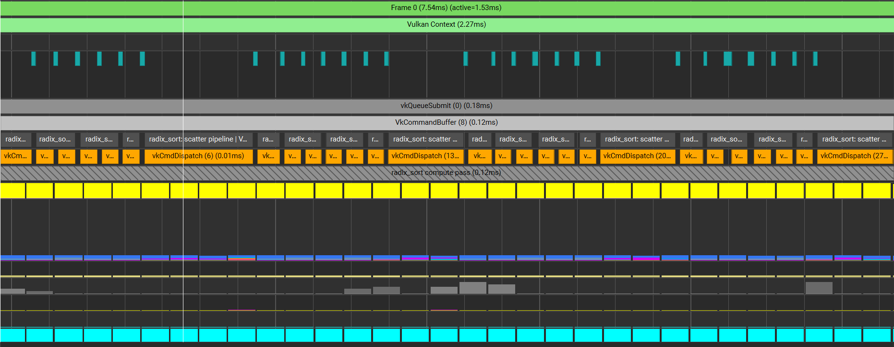
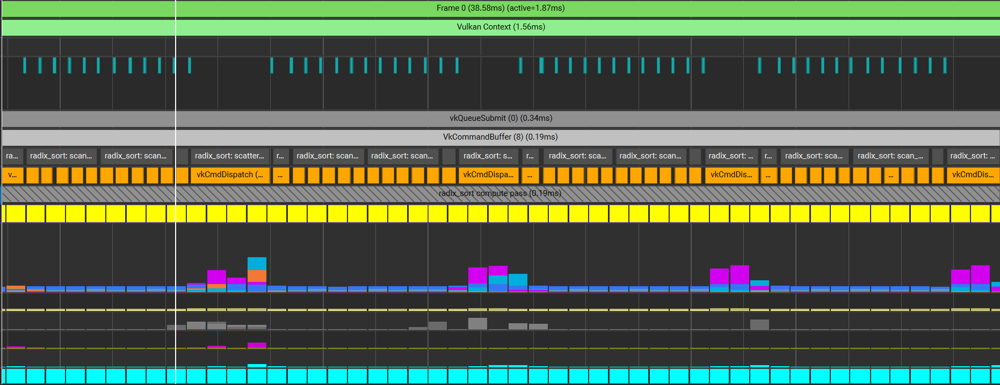
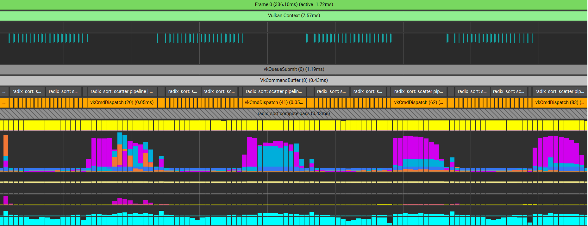
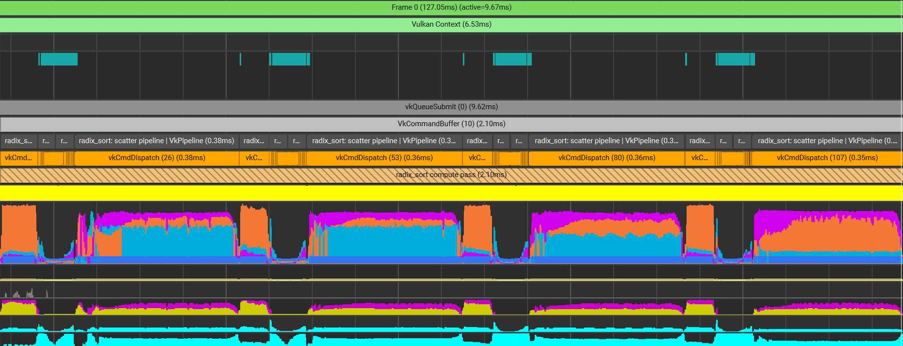

# Bevy Radix Sort

A **low-level**, high-performance GPU-based radix sort plugin for Bevy, optimized for sorting key/value pairs of type `u32`.

[](https://crates.io/crates/bevy_radix_sort)
[](https://github.com/AllenPocketGamer/bevy_radix_sort#license)

## Features

- Based on the paper [Fast 4-way parallel radix sorting on GPUs](http://www.sci.utah.edu/~csilva/papers/cgf.pdf)
- High-performance `radix sort` implementation fully executed on the GPU
- High compatibility, capable of running on most modern GPUs
- Efficient for large datasets with minimal CPU overhead

## Limitations

- Currently not supported on web platforms (due to the lack of push_constants support in the WebGPU standard)
- Optimized specifically for `u32` key/value pairs

## Installation

Add the following dependency to your `Cargo.toml`:

```toml
[dependencies]
bevy_radix_sort = "0.15.0"
```

## Benchmark

**Important Note on GPU Benchmarking:**

Designing automated GPU benchmarks in Bevy presents significant challenges. Benchmark results can vary widely across different platforms, hardware configurations, and driver versions, making it difficult to provide standardized performance metrics.

For accurate performance analysis, I recommend using GPU-specific profiling tools:

- **NVIDIA**: [Nsight Graphics](https://developer.nvidia.com/nsight-graphics)
- **AMD**: [Radeon GPU Profiler](https://gpuopen.com/rgp/)
- **Apple**: [Metal System Trace](https://developer.apple.com/documentation/metal/debugging_tools/capturing_gpu_command_data_programmatically) in Xcode
- **Intel**: [Graphics Performance Analyzers](https://www.intel.com/content/www/us/en/developer/tools/graphics-performance-analyzers/overview.html)
- **Vulkan/Cross-platform**: [RenderDoc](https://renderdoc.org/)

These tools provide detailed insights into GPU execution times, memory usage, and potential bottlenecks that simple timing measurements cannot capture.

### Performance Results

Below are benchmark results from testing on an NVIDIA RTX 4070 Ti Super:

- __10k kvs__

- __100k kvs__

- __1000k kvs__

- __10000k kvs__


| Number of Key-Value Pairs | Execution Time (ms) |
|---------------------------|---------------------|
| 10,000                    | 0.12                |
| 100,000                   | 0.19                |
| 1,000,000                 | 0.43                |
| 10,000,000                | 2.10                |

*Note: Performance may vary based on system configuration, driver version, and concurrent GPU workloads.*

## Usage

Check out the [example implementation](./examples/simple_gpu_sort.rs) to see how to integrate the radix sort into your Bevy application.

## Contributing

Contributions are welcome! Feel free to submit issues or pull requests on our [GitHub repository](https://github.com/AllenPocketGamer/bevy_radix_sort).

## License

Licensed under either of

 * Apache License, Version 2.0 ([LICENSE-APACHE](LICENSE-APACHE) or http://www.apache.org/licenses/LICENSE-2.0)
 * MIT license ([LICENSE-MIT](LICENSE-MIT) or http://opensource.org/licenses/MIT)

at your option.